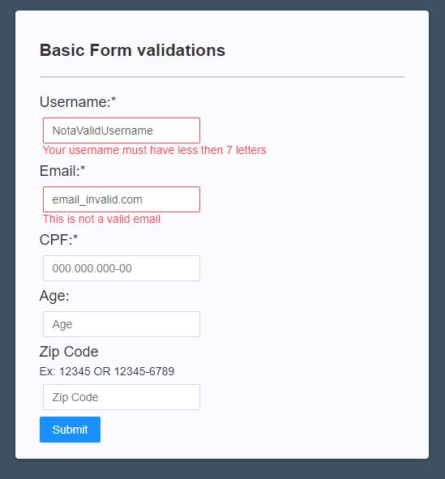

    

<h3 align="center" style="border-bottom: none;">Input Wizard</h3>

<h4 align="center">Example</h4>

[Codesandbox example](https://codesandbox.io/s/github/PeterPimentel/react-input-wizard/tree/master/example)

  

## License

MIT © [PeterPimentel](https://github.com/PeterPimentel)
